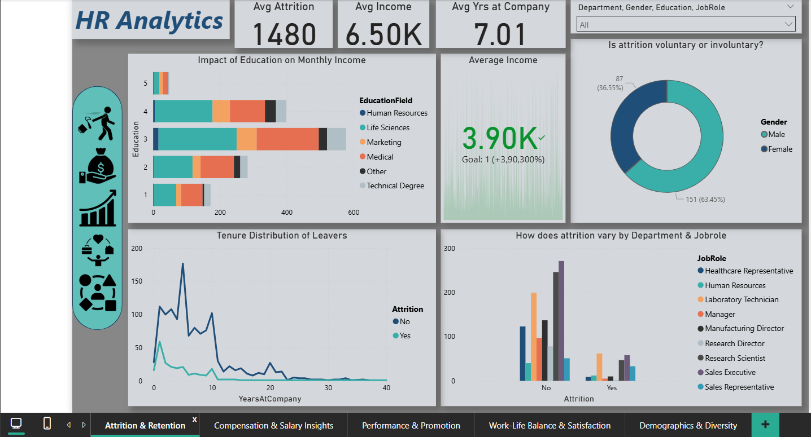
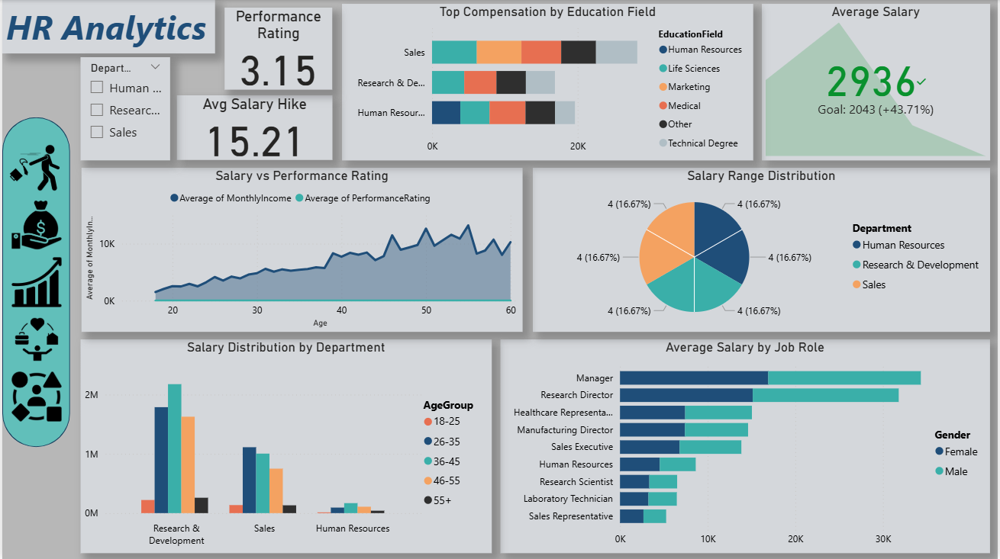
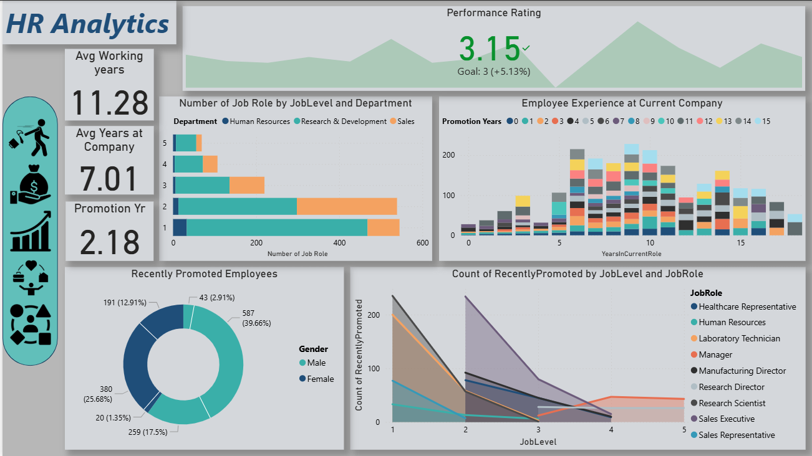
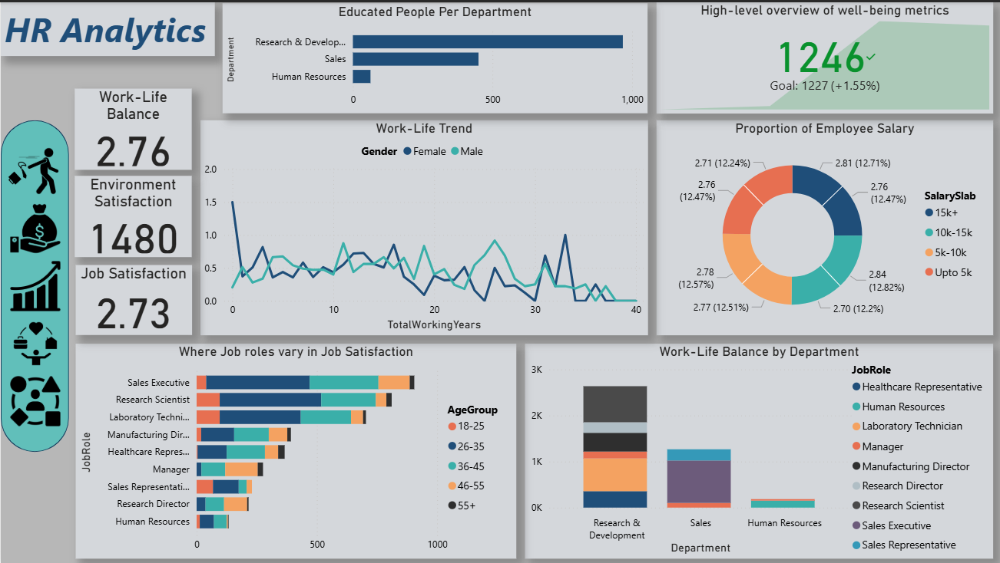
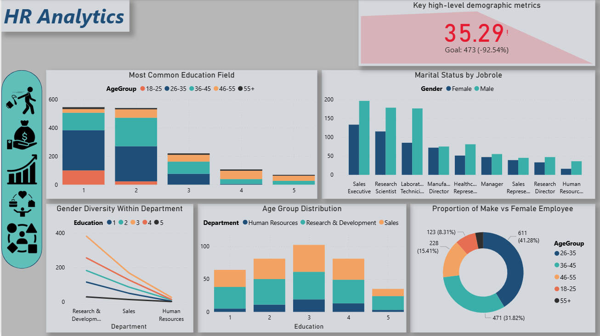

# 📊 HR Analytics Dashboard (Power BI)

This project presents an interactive HR Analytics Dashboard built using Power BI to analyze employee data and derive actionable insights for human resource management.

---

## 🚀 Overview

The dashboard provides a data-driven view into key HR metrics such as employee attrition, job satisfaction, promotions, departmental distribution, and salary insights. It helps HR professionals understand employee behavior and optimize workforce planning.

---

## 📁 Dataset

The dataset includes anonymized HR data such as:

- Employee ID, Age, Gender, Department
- Job Role, Education, Marital Status
- Monthly Income, Years at Company
- Job Satisfaction, Work-Life Balance
- Attrition status (Yes/No)

---

## 📈 Dashboard Features

- ✅ **KPI Cards**: Total Employees, Attrition Count, Average Salary, Avg Job Satisfaction
- 📊 **Charts & Visuals**:
  - Attrition by Department & Job Role
  - Gender-wise and Age-wise attrition
  - Education vs Monthly Income distribution
  - Years at Company vs Attrition trend
  - Job Satisfaction vs Work-Life Balance heatmap
- 🔍 **Interactive Filters**:
  - Department, Gender, Job Role, Education Level

---

## 🛠 Tools Used

- **Power BI Desktop**: For dashboard creation and data modeling
- **DAX**: For calculated columns and measures
- **Data Transformation**: In Power Query Editor

---

# Power BI Dashboard

---

---

---

---

---

## 🎯 Business Impact

This dashboard can be used by HR departments to:

- Identify high-risk areas for employee turnover
- Analyze salary trends and promotion fairness
- Improve employee engagement and retention
- Make informed workforce planning decisions

---

## 📥 How to Use

1. Download or clone this repository
2. Open the `.pbix` file using Power BI Desktop
3. Connect to the sample dataset or replace with your own
